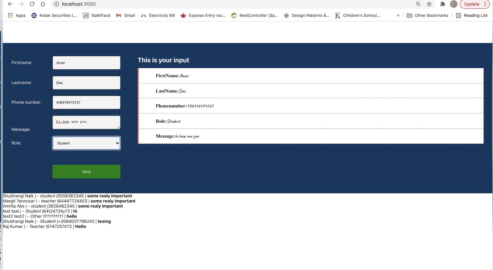

# Postng data using dummy json server on local machine

## Steps
1. Create react app
- Clean the code
- Create form, and view window on ´onchange`event.
2. `npm install json-server --save-dev`
3. Add below line to start scripts in package.json
    "server":"json-server -p3001 --watch db.json”
Step4: Run server in one terminal
`npm run server`
-- It will run server and if u put
Localhost:3001/jsonfilename(in this case 'db.json')
-- It will show content from json file
4. Run application(npm start) in another terminal
` localhost:3000`
### Tip: Application and server should be running, while posting data

### Link to study more:
https://github.com/typicode/json-server

## controlled components and work with forms.

# Form
* Firstname
* Lastname
* Phone
* Message
* Role
* submit

# View
- Firstname
- Lastname
- Phone
- Message
- Role
## Onsubmit **popupHandler()**
on submit calls popupHandler

