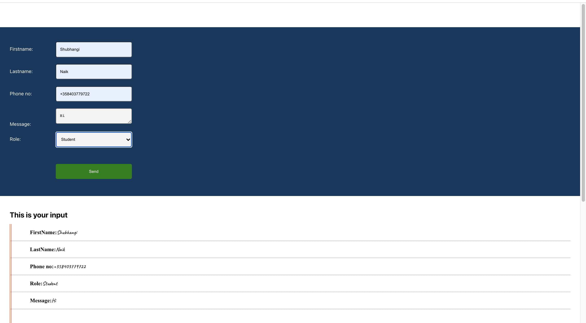
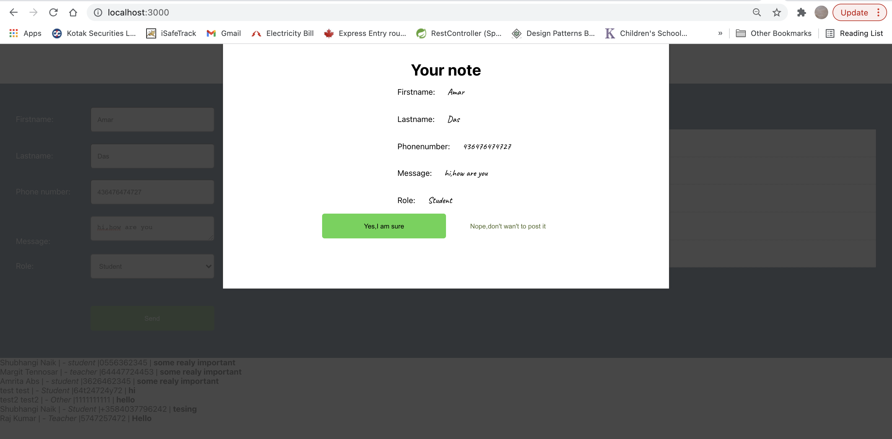

# Getting Started with 
## controlled components and work with forms.

# Form
* Firstname
* Lastname
* Phone
* Message
* Role
* submit
## Onsubmit **popupHandler()**
on submit calls popupHandler

# View
- Firstname
- Lastname
- Phone
- Message
- Role
